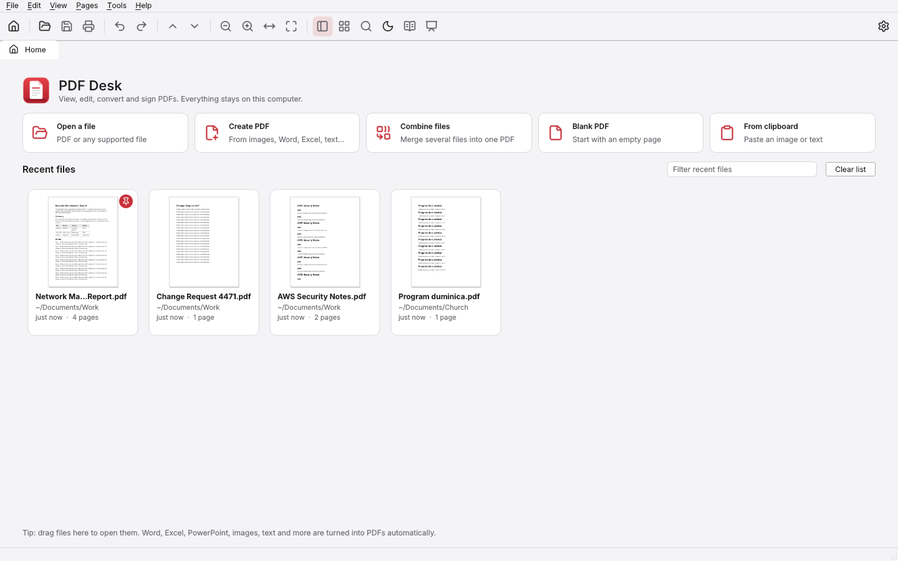
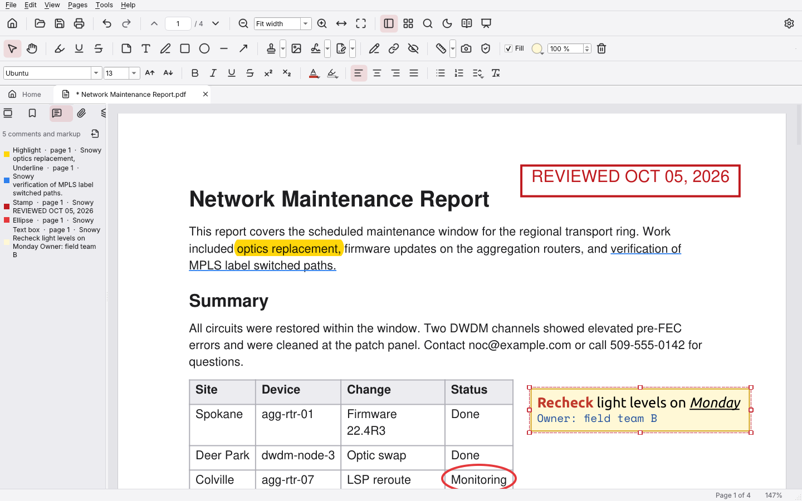
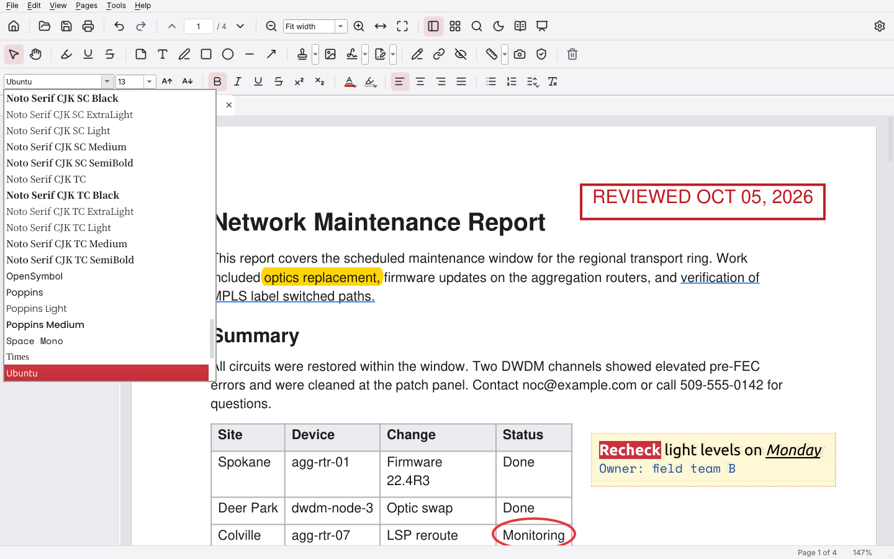
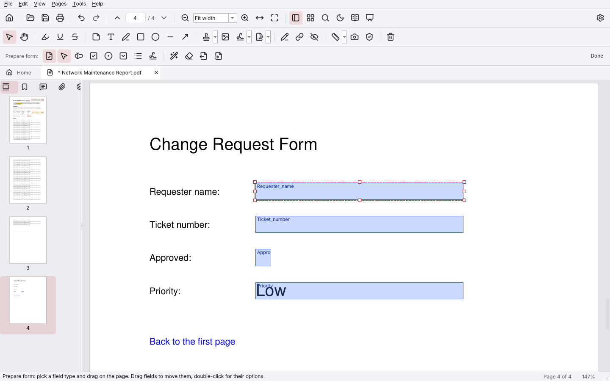
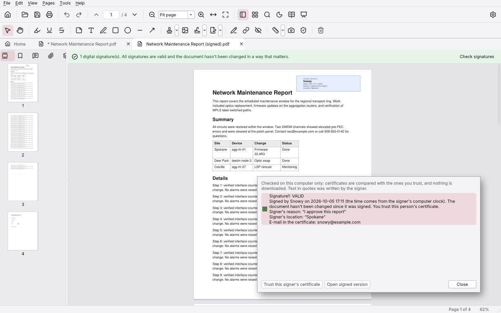
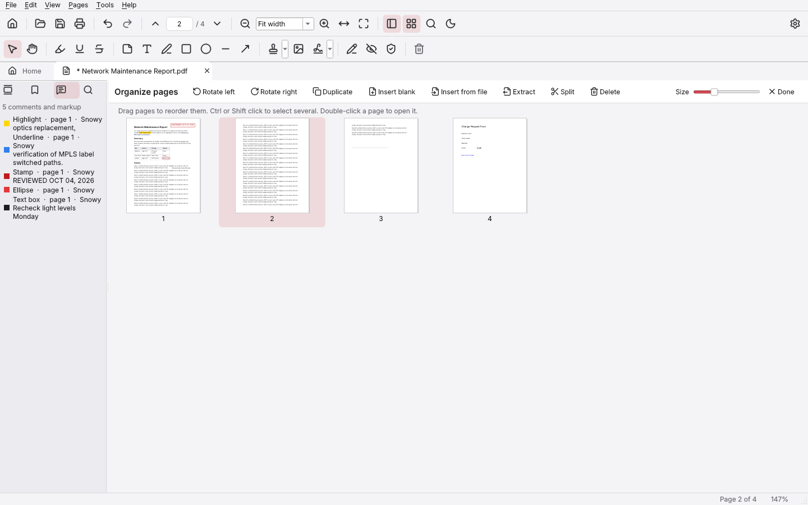
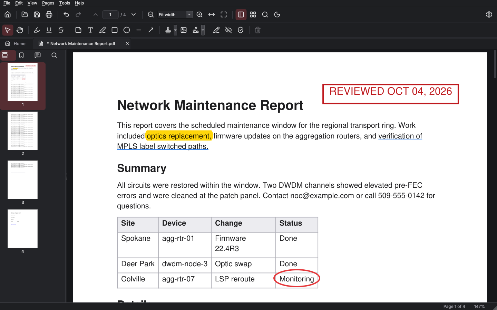

# PDF Desk

PDF Desk is a PDF viewer, editor and converter for Linux and Windows. It covers the everyday things Adobe Acrobat is used for: reading, highlighting and commenting, text boxes with any font on your computer, filling and creating forms, signing (by hand or with a Digital ID), editing text, moving pages around, redacting, comparing files, measuring, compressing, password protecting, OCR, reading out loud, and turning other files into PDFs or PDFs into other files.

Everything runs on your own computer and works the same with no Wi-Fi. The only thing PDF Desk does online is check GitHub for a new version, once a day at most, and you can turn that off in Preferences. Updates only install when you say yes, and only if they're signed with the PDF Desk release key. The only time a link opens your browser is when you click a web link inside a PDF, and it asks first. See [Security](#security) for details.

**New in 2.0.1:** automatic updates. See [Updates](#updates).

**New in 1.1:** Word-style text formatting with a font list, Prepare Form, Fill & Sign, Digital IDs and certificate signatures, Read Out Loud, Compare files, Presentation mode, Reader view, measuring, links, attachments, layers, page labels, backgrounds, N-up and booklet printing, Bates numbering and more. See [What's new in 1.1](#whats-new-in-11).



## Features

**Home screen and recent files**
- Every PDF you open shows up on the Home screen with a thumbnail, its folder, when you last opened it and the page count
- Reopens files at the page where you left off
- Pin files to keep them at the top, filter the list, remove entries, or show the file in its folder
- Quick buttons for Open, Create PDF, Combine files, Blank PDF and From clipboard
- Drag any file onto the window to open it (or convert it)

**Viewing**
- Tabs for several documents at once
- Smooth scrolling, one page or two pages side by side (with or without a cover page)
- Zoom with Ctrl + mouse wheel, touchpad pinch, fit width, fit page or a typed percentage
- Sidebar with page thumbnails, bookmarks, a list of all comments, attachments, layers and search results
- Search the whole document with every match highlighted
- Clickable links, night mode for reading in the dark, full screen, light and dark themes
- Presentation mode (F5): one page at a time, full screen, with the keyboard, mouse or a presenter remote
- Reader view (Ctrl+4): the text reflowed into simple paragraphs with large letters and light, sepia or dark colors
- Read Out Loud: the page, the rest of the document or the selected text, with a speed setting
- Print through your normal system print dialog



**Comment and mark up**
- Highlight, underline and strike through text (highlight also works as a box on scanned pages)
- Sticky notes, text boxes, freehand drawing, rectangles, ellipses, lines and arrows
- 14 standard stamps (Approved, Draft, Confidential...) plus text stamps with today's date
- Select any comment to move it, resize it, change its color, line width or opacity, or delete it
- Comment summary: save all comments as a CSV spreadsheet or a Markdown list
- Undo and redo for every change



**Text boxes like a word processor**
- A formatting bar like Word's: font list (every font on your computer, plus fonts that come with PDF Desk), size, bold, italic, underline, strikethrough, superscript, subscript, text color and highlight color
- Left, centered, right and justified paragraphs, bullets, numbering and line spacing
- Mix formatting inside one box, for example one bold red word in a normal sentence
- Each font name in the list is shown in its own font, and the fonts you used last are at the top. Type part of a name to find a font quickly
- The fonts are embedded in the PDF (only the letters used), so the text looks the same on every computer
- The same font list is used for headers and footers, watermarks and Edit Text

**Edit**
- Edit text: click a paragraph and retype it with the formatting bar. PDF Desk matches the original font, size, color and alignment, and rewraps the lines
- Add images and signatures. Draw, type or import your signature once and reuse it. Images can be moved and resized later
- Links: drag a box to link to a page in the document or to a web page, click a link to change or remove it
- Attach files to the PDF, and save or open attachments from the sidebar
- Redact: mark text or areas, or use Find and Redact with ready-made patterns (emails, phone numbers, SSNs, card numbers, IP addresses, AWS account IDs, access keys and ARNs), then apply to remove the content for good
- Flatten comments and forms into the page (all at once or one item at a time), remove hidden information (metadata, scripts, attachments)



**Forms**
- Fill in forms: text fields, check boxes, radio buttons, drop-down lists and list boxes (Romanian letters like ș and ț work)
- Prepare Form: add text fields, check boxes, radio button groups, drop-downs, list boxes and signature fields, move and resize them, and set their name, tooltip, required, read-only, look and choices
- Find form fields automatically: PDF Desk spots lines, underscores and boxes on a plain page and turns them into fields
- Export form data (CSV, JSON or XFDF), import it again, or clear the form
- Fill & Sign: fill in a form that has no fields by clicking to type text or place a check mark, cross, dot, today's date or your initials

**Signatures**
- Handwritten signatures: draw, type or import one and place it anywhere
- Digital IDs: create your own (saved on your computer, locked with a password) or import a .p12 / .pfx file from your organization
- Sign with a Digital ID: drag a box for a visible signature (with your name, date, reason and optional handwritten signature) or sign an empty signature field. The signed copy is saved as a new file
- Check signatures: see who signed, whether anything changed after signing, and whether you trust the signer. A colored bar at the top of a signed PDF shows the result
- Open signed version: see the document exactly as it was when it was signed, and compare it with the current one
- Comments, form filling and more signatures can be added to a signed PDF without breaking its signatures. PDF Desk warns before a change (such as editing page text) would make them show as invalid





**Pages**
- Organize Pages view: drag pages to reorder, rotate, duplicate, delete, insert blank pages or pages from any file
- Extract pages to a new PDF (as one file or one file per page)
- Split by every N pages, by page ranges, or by bookmarks
- Crop margins, change the page size (A4, Letter and more) or remove blank pages
- Headers, footers, page numbers and Bates numbering, text or image watermarks and backgrounds (with a live preview)
- Page labels: number the front pages i, ii, iii and the rest 1, 2, 3, the way Acrobat does
- Make bookmarks from the headings in the document
- Pages per sheet (2, 4, 6, 9 or 16 on one sheet) and booklet printing

**Create PDFs from other files**
- Images: PNG, JPEG, WebP, BMP, GIF, TIFF (including multi-page TIFF) and more
- Word, Excel, PowerPoint, OpenDocument, RTF and more (through LibreOffice when it is installed; .docx, .xlsx and .pptx also work without it, with a simpler layout)
- Text and code files, Markdown, HTML, CSV
- E-books and other documents: EPUB, MOBI, FB2, XPS, CBZ, SVG
- Combine many files of mixed types into one PDF, or paste an image or text from the clipboard

**Export PDFs to other formats**
- Word (.docx), Excel (.xlsx, tables become sheets), PowerPoint (.pptx)
- OpenDocument text (.odt) and Rich Text (.rtf) when LibreOffice is installed
- PNG, JPEG, WebP, multi-page TIFF and SVG images
- Plain text, HTML and Markdown

**Document tools**
- Compare files: a report PDF that shows what text was added and removed between two versions
- Measure distances, perimeters and areas on drawings and plans, with your own scale (for example 1 cm = 2 m)
- Snapshot: copy part of a page as a picture
- Reduce file size (clean up only, balanced, smallest, or custom image resolution and quality)
- Convert to grayscale, save all pictures in the document
- Protect with a password (AES-256) and choose what people may do: print, copy, edit, comment, fill forms
- Remove a password
- Recognize text (OCR) in scanned PDFs, so they can be searched and copied. The pages keep looking exactly the same
- Edit the title, author, subject and keywords, and see page size, PDF version, fonts and security details



## Install on Linux

You need Python 3.12 or newer (Fedora 39+ and Ubuntu 24.04+ already have it).

```bash
cd "PDF Desk"
./install.sh
```

That installs PDF Desk for your user only (no sudo), adds it to your app menu and to the "Open with" list for PDF files, and adds a `pdfdesk` command. The first install downloads the Python packages it needs. After that the only internet use is the daily update check (see [Updates](#updates)).

Options:

| Option | What it does |
|---|---|
| `./install.sh --default` | Also make PDF Desk the default app for PDF files |
| `./install.sh --extras` | Also install LibreOffice, the English and Romanian OCR language files and the espeak-ng voice for Read Out Loud (asks for your sudo password) |
| `./install.sh --wheels DIR` | Install the Python packages from a folder instead of downloading them |
| `./install.sh --unlocked` | Use the newest package versions instead of the tested, hash-checked ones (also works with Python 3.10 and 3.11) |

Run `./install.sh` again any time to update. To remove it, run `~/.local/share/pdf-desk/uninstall.sh` (add `--purge` to also delete your settings and signatures).

## Install on Windows

1. Double-click `install.bat`. No administrator rights are needed.
2. If Python 3.12 or newer isn't installed yet, the installer asks whether to install it for your account with winget (type y to agree). You can also install it yourself from python.org (tick "Add python.exe to PATH").

PDF Desk is installed to `%LOCALAPPDATA%\Programs\PDF Desk`, gets a Start menu shortcut, shows up in the "Open with" list for PDF files, and can be removed from Settings > Apps like any other program.

Options (run from PowerShell in the PDF Desk folder):

```powershell
powershell -ExecutionPolicy Bypass -File install.ps1 -Desktop -AddToPath
```

| Option | What it does |
|---|---|
| `-Desktop` | Also put a shortcut on the desktop |
| `-AddToPath` | Add the `pdfdesk` command to your PATH |
| `-Wheels DIR` | Install the Python packages from a folder instead of downloading them |
| `-Unlocked` | Use the newest package versions instead of the tested, hash-checked ones |

To make PDF Desk the default PDF app on Windows, right-click any PDF, choose Open with > Choose another app, pick PDF Desk and tick "Always".

## Optional extras

PDF Desk works on its own. These free extras add more:

**LibreOffice** gives full-quality conversion of Word, Excel, PowerPoint and OpenDocument files, and exporting to .odt and .rtf.
- Fedora: `sudo dnf install libreoffice`
- Ubuntu/Debian: `sudo apt install libreoffice`
- Windows: install it from libreoffice.org, then restart PDF Desk

**OCR language files** are needed for Recognize Text. PDF Desk has the OCR engine built in, it only needs the language data.
- Fedora: `sudo dnf install tesseract-langpack-eng tesseract-langpack-ron`
- Ubuntu/Debian: `sudo apt install tesseract-ocr-eng tesseract-ocr-ron`
- Windows: install Tesseract OCR (the UB Mannheim build) and tick the languages you want, or copy `.traineddata` files into `%APPDATA%\PDF Desk\tessdata`

**A voice for Read Out Loud** (Linux only, Windows has voices built in): install espeak-ng.
- Fedora: `sudo dnf install espeak-ng`
- Ubuntu/Debian: `sudo apt install espeak-ng`

You can point PDF Desk at a custom LibreOffice or language folder in Preferences > Extras.

## Standalone build (no Python on the target computer)

To get a folder you can copy to another computer and run straight away, even one without internet:

- Linux: `./build.sh` makes `dist/PDF Desk/pdfdesk` and `dist/PDF-Desk-linux-x86_64.tar.gz`. After extracting it somewhere, run `install-desktop-entry.sh` inside the folder to add it to your app menu.
- Windows: `powershell -ExecutionPolicy Bypass -File build.ps1` makes `dist\PDF Desk\PDF Desk.exe` and a zip. If Inno Setup 6 is installed it also makes `dist\PDF-Desk-Setup.exe`, a normal installer that doesn't need admin rights. Use either that Setup.exe or `install.bat` on a computer, not both, since they install to the same folder.

The build itself needs internet once to download the packages. The result is around 450 MB unpacked because it carries its own Python, Qt and the conversion libraries.

To install on a computer that has Python but no internet, download the packages on another computer first and copy the `wheels` folder over:

```bash
pip download --require-hashes -r requirements.lock -d wheels       # same OS and Python version as the target
./install.sh --wheels wheels                                       # Linux
powershell -ExecutionPolicy Bypass -File install.ps1 -Wheels wheels  # Windows
```

## Tips

- **Esc** goes back to the Select tool. The tool hint next to the toolbar says what the current tool does.
- **Text boxes:** click to start typing, or drag a box first. Pick the font, size and style in the formatting bar before or while you type, or select some words and change just those. Click outside the box or press **Ctrl+Enter** to finish. Double-click a text box or note later to change it.
- **Selected comments:** drag to move, drag a corner handle to resize, use the color, width and opacity controls in the toolbar to restyle, arrow keys to nudge (Shift for bigger steps), Delete to remove.
- **Right-click** on the page for quick actions: copy, highlight, add a note, rotate, insert or delete the page, copy the page as an image.
- **Redaction** is two steps on purpose. Marked areas show a red outline. Nothing is removed until you click Apply redactions, and the file only changes when you save.
- **Edit text** works one paragraph at a time. PDF Desk uses the original font when it can, or the closest font on your computer. Text that's part of an image needs OCR first and can't be edited this way.
- **Images and signatures** can be moved and resized like comments. Right-click one and choose Flatten to make it a permanent part of the page.
- **Measuring:** pick Distance, Perimeter or Area from the Measure tool's menu. For perimeters and areas, click each corner and double-click (or press Enter) to finish. Set the drawing scale in Tools > Measuring scale.
- **Digital signatures:** sign last. Comments and form filling added later are allowed and reported, but changing the page content of a signed PDF makes its signatures invalid, so PDF Desk warns first.
- Changes stay in PDF Desk until you save, and the tab title shows an asterisk while there are unsaved changes.

## Keyboard shortcuts

| Action | Keys |
|---|---|
| Open / Save / Save as | Ctrl+O / Ctrl+S / Ctrl+Shift+S |
| Print | Ctrl+P |
| Close tab / switch tabs | Ctrl+W / Ctrl+Tab |
| Home screen | Ctrl+H |
| Undo / Redo | Ctrl+Z / Ctrl+Y |
| Find / next / previous | Ctrl+F / F3 / Shift+F3 |
| Copy selected text | Ctrl+C |
| Zoom in / out / actual size | Ctrl++ / Ctrl+- / Ctrl+0 |
| Fit width / fit page | Ctrl+1 / Ctrl+2 |
| Go to page | Ctrl+G |
| Rotate page | Ctrl+R / Ctrl+Shift+R |
| Organize pages | Ctrl+Shift+O |
| Add bookmark | Ctrl+B |
| Sidebar | F4 |
| Full screen | F11 |
| Presentation | F5 (Esc to leave) |
| Reader view | Ctrl+4 |
| Read page out loud / to the end / stop | Ctrl+Shift+Y / Ctrl+Shift+B / Ctrl+Shift+E |
| Text box: bold / italic / underline | Ctrl+B / Ctrl+I / Ctrl+U (while typing) |
| Text box: bigger / smaller text | Ctrl+] / Ctrl+[ (while typing) |
| Text box: left / center / right / justify | Ctrl+L / Ctrl+E / Ctrl+R / Ctrl+J (while typing) |
| Night mode | Ctrl+Shift+N |
| Document properties | Ctrl+D |
| Create PDF from clipboard | Ctrl+Shift+V |
| All shortcuts | F1 |

## Updates

PDF Desk checks the [GitHub releases](https://github.com/Snowblind019/PDF-Desk/releases) for a newer version when it starts, at most once a day. If there is one, it asks whether to install it. Click **Install now** and PDF Desk downloads the update, checks it, closes (asking you to save any changes first), installs it and opens again. **Not now** asks again next time, and **Skip this version** stops asking until an even newer one comes out.

- **Help > Check for updates** checks right away.
- To stop the daily check, untick "Check for updates when PDF Desk starts" in Edit > Preferences. Nothing goes online after that unless you use Help > Check for updates.
- The check sends nothing about you or your files: it's a single request to GitHub that only includes the PDF Desk version number. Installing an update also lets pip fetch any changed Python packages from PyPI.
- An update installs only if it's signed with the PDF Desk release key, whose public half ships with PDF Desk (`pdfdesk/assets/update-key.pub`). A download that isn't signed by that key, or that was changed on the way, is refused and nothing is changed. Even someone who took over the GitHub account couldn't push an update without the key.
- If more than one PDF Desk window is open, close the others first. The update waits until every window has closed, and PDF Desk can't be started while it installs.
- Automatic updates work for copies installed with `install.sh` or `install.bat`. They run that same installer, so the Python packages still come from `requirements.lock` and are hash-checked. Standalone builds, copies run straight from the source folder and copies installed with `--unlocked` get a link to the download page instead.

### Publishing a release (for the maintainer)

Once, on your own computer: `python3 tools/make_release.py init`. This creates the release key, saves the private half outside the repo (`~/.config/pdf-desk-release/` on Linux, `%APPDATA%\pdf-desk-release\` on Windows) locked with a passphrase you choose, and writes the public half to `pdfdesk/assets/update-key.pub`. Commit that file. Back up the private key and its passphrase: without them you can't sign updates, and installed copies would need to be updated by hand.

For each release:

1. Change `__version__` in `pdfdesk/__init__.py` (and the version in `install.ps1` and `installer.iss`), commit and push.
2. Run `python3 tools/make_release.py build`. It makes `dist/PDF-Desk-<version>.zip` and `dist/PDF-Desk-<version>.zip.sig` and checks them.
3. Create a GitHub release tagged `v<version>` and attach both files, for example `gh release create v2.0.2 dist/PDF-Desk-2.0.2.zip dist/PDF-Desk-2.0.2.zip.sig --title "PDF Desk 2.0.2"`. The release notes are shown in the update prompt.

The script needs the `cryptography` package; PDF Desk's own Python has it (`~/.local/share/pdf-desk/venv/bin/python tools/make_release.py build`).

## Where things are stored

| | Linux | Windows |
|---|---|---|
| Settings, recent files list, signatures | `~/.config/pdfdesk/` | `%APPDATA%\PDF Desk\` |
| Digital IDs and trusted certificates | `~/.config/pdfdesk/digital-ids/` and `trusted-certificates/` | `%APPDATA%\PDF Desk\digital-ids\` and `trusted-certificates\` |
| Thumbnails, font list, temporary files and downloaded updates | `~/.cache/pdfdesk/` | `%LOCALAPPDATA%\PDF Desk\cache\` |
| Program | `~/.local/share/pdf-desk/` | `%LOCALAPPDATA%\Programs\PDF Desk\` |

Handwritten signatures are saved as PNG files in the `signatures` folder and never leave your computer. Digital IDs are kept in a folder only your account can open, each locked with its own password (at least 8 characters, protected with AES-256 and 600,000 rounds of password hashing). Back up the `digital-ids` folder if you want to keep your IDs: without the file and its password nobody, including you, can sign with that ID again.

## Troubleshooting

- Run `pdfdesk --check` (Linux) to test every part: libraries, fonts, conversions, LibreOffice and OCR. On Windows run `"%LOCALAPPDATA%\Programs\PDF Desk\venv\Scripts\python.exe" "%LOCALAPPDATA%\Programs\PDF Desk\app\pdfdesk.py" --check`.
- Opening a PDF while PDF Desk is already running opens it as a new tab in the same window. Use `pdfdesk --new-window` for a separate window.
- If an Office file won't convert, check that LibreOffice is found in Preferences > Extras. PDF Desk uses its own LibreOffice profile, so conversions work even while LibreOffice is open.
- A scanned PDF can't be searched or copied from until you run Tools > Recognize text (OCR).

## Project layout

| Path | What's in it |
|---|---|
| `pdfdesk/app.py` | Start-up, theme, single window handling, `--check` |
| `pdfdesk/mainwindow.py` | Menus, toolbars, tabs and every command |
| `pdfdesk/home.py`, `recents.py` | Home screen and the recent files list |
| `pdfdesk/canvas.py` | The page view: rendering, zoom, selection and all the mouse tools |
| `pdfdesk/doctab.py`, `sidebar.py`, `organizer.py` | Document tab, sidebar panels, Organize Pages |
| `pdfdesk/annots.py`, `appearance.py` | Creating and changing comments and form fields, and how they look |
| `pdfdesk/richtext.py`, `textformat.py`, `textedit.py` | Formatted text boxes, the formatting bar and Edit Text |
| `pdfdesk/fontcatalog.py`, `fonts.py` | The font list (system and bundled fonts) and font embedding |
| `pdfdesk/forms.py` | Prepare Form, field detection, form data import and export |
| `pdfdesk/docfeatures.py` | Links, attachments, page labels, backgrounds, page size, N-up, booklets, comment summary |
| `pdfdesk/digitalid.py`, `sigdiff.py` | Digital IDs, signing, checking signatures and what changed after signing |
| `pdfdesk/measure.py`, `compare.py`, `present.py`, `reader.py`, `speech.py` | Measuring, Compare files, Presentation, Reader view, Read Out Loud |
| `pdfdesk/pdfops.py` | Page tools, split, watermark, headers, compression, passwords, OCR, redaction |
| `pdfdesk/convert.py` | Importing to PDF and exporting to other formats |
| `pdfdesk/dialogs.py`, `signature.py` | Dialog windows and the signature manager |
| `pdfdesk/updater.py`, `update_ui.py` | Update checks, signed downloads and installing updates |
| `tools/make_release.py` | Makes and signs a release (maintainer only, not installed) |
| `pdfdesk/locks.py` | Knowing which PDF Desk windows are open, so updates wait for them |
| `tests/` | Automated tests (`python -m pytest -q tests`), including a full headless GUI run |

## Security

PDF Desk was checked line by line for anything harmful and for security bugs (see `SECURITY-REVIEW.md`). In short:

- **The only network use is the update check and installing updates.** It talks to GitHub over HTTPS only, follows no redirects to other sites, sends nothing but the PDF Desk version, can be turned off in Preferences, and installs nothing that isn't signed with the PDF Desk release key (see [Updates](#updates)). Nothing else in PDF Desk talks to the internet. The only outside programs it runs are LibreOffice (for Office conversions), Tesseract (only to list OCR languages) and the system speech engine for Read Out Loud (espeak-ng on Linux, Windows' own voices through PowerShell), always with fixed arguments and never through a shell. The text to read is passed on standard input, never on a command line.
- **Digital signatures are checked offline.** Signing never contacts a time-stamp server, and checking never downloads certificates or revocation lists. pyHanko's network code is installed with it but is switched off in PDF Desk. You decide which certificates you trust, and a personal certificate you trust can't vouch for anyone else.
- **Changes after signing are checked, not just the signature.** A signed PDF can carry later updates. PDF Desk compares the signed version with the current one and marks the signature as not valid when page content, form fields or document actions were changed, so a file can't keep a valid signature while showing something else.
- **Links inside PDFs are treated as untrusted.** Web links only open after you confirm, and only `http`, `https` and `mailto` links are allowed. Links to other files only open other local PDFs, after you confirm. Links to network shares (`\\server\share`, mapped network drives), `file://` addresses, unusual Windows device paths and "launch" actions are blocked. Before you confirm a web link, PDF Desk shows the real site name, and warns when it uses look-alike letters. PDF JavaScript never runs.
- **Text from inside a PDF is always shown as plain text**, so a booby-trapped title or bookmark can't make Qt load files or network shares.
- **LibreOffice runs with a locked-down private profile**: macros, embedded objects (OLE) and DDE links are disabled, linked images and other linked content are never fetched from the internet or network shares, links aren't updated and spreadsheet formulas aren't recalculated when a file is converted. CSV files are converted with PDF Desk's own code, so formulas in them never run.
- **Exports are defused**: text that starts with `=` becomes plain text in Excel exports, never a live formula.
- **Python packages are pinned and hash-checked.** `requirements.lock` lists the exact versions PDF Desk was tested with and the SHA-256 hash of every file. pip refuses to install anything that doesn't match.
- **Single-window hand-off is private to your user.** Only your own account can talk to a running PDF Desk, and it proves itself with a random secret before a second launch hands over file names.

## Limits

- PDF JavaScript, 3D content, video and XFA forms are not supported (XFA forms show their plain PDF version, if they have one).
- Underline and strikethrough on the same words in a text box show only the underline.
- Edit Text works on real text. Scanned pages need OCR first, and text drawn as shapes can't be edited.
- A password-protected PDF has to have its password removed before it can be signed with a Digital ID (protect it again afterwards).
- Signatures are checked against the certificates you trust on this computer. Certificate revocation isn't checked (that would need the internet), and the signing time comes from the signer's own clock.
- Read Out Loud uses the voices installed on your system; on Linux that usually means espeak-ng, which sounds robotic.

## What's new in 1.1

- Text boxes with a Word-style formatting bar and a font list built from the fonts on your computer
- Edit Text works on whole paragraphs and keeps the original look
- Prepare Form, automatic field detection, form data export and import, Fill & Sign
- Digital IDs, signing with a certificate, checking signatures and opening the signed version
- Links, attachments, layers, page labels, backgrounds, page size, blank page removal, N-up and booklets, Bates numbering
- Compare files, measuring, snapshots, comment summary, grayscale, save all pictures, bookmarks from headings
- Presentation mode, Reader view and Read Out Loud
- Images and signatures stay movable until you flatten them
- A second security review (see `SECURITY-REVIEW.md`)

## License notes

PDF Desk is built on PyMuPDF/MuPDF, which is licensed under the GNU AGPL 3.0. If you publish PDF Desk or share builds of it, publish its source code under the AGPL 3.0 (or another compatible license) as well. Digital signatures use pyHanko (MIT license) and the cryptography package (Apache 2.0 / BSD). Fonts come from pymupdf-fonts and your own system (open font licenses; fonts whose license doesn't allow embedding are left out of the list). Toolbar icons are from Lucide (ISC license, see `pdfdesk/icons/LICENSE-lucide.txt`). Qt for Python is LGPL 3.0.
